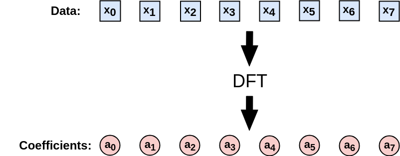
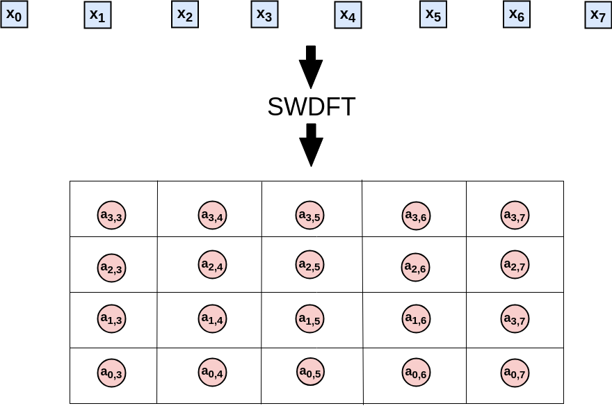
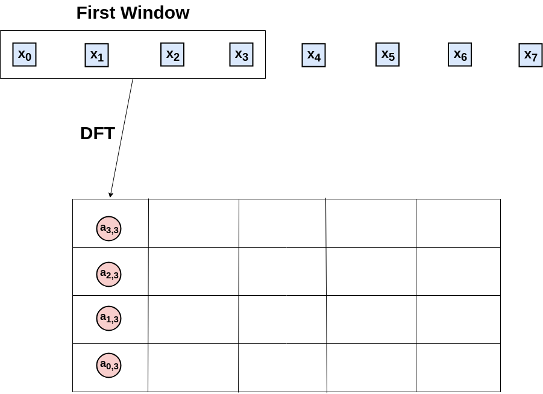
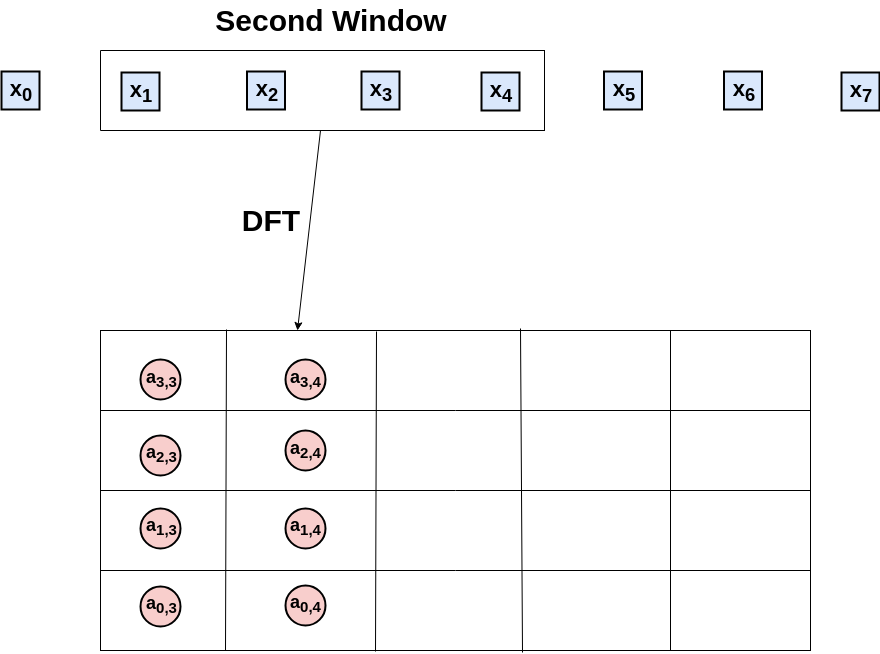
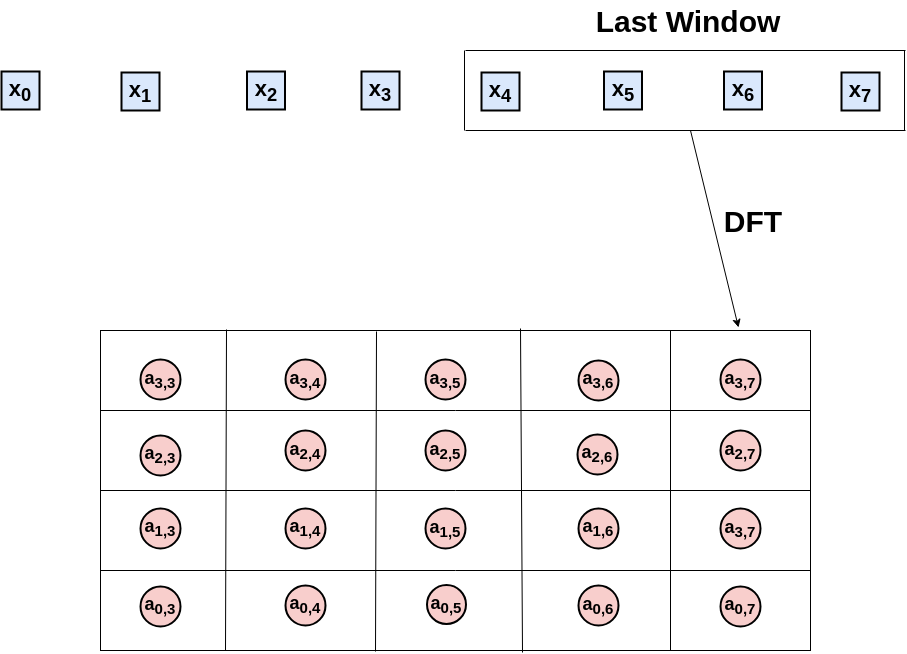

```{r setup, include = FALSE}
knitr::opts_chunk$set(
  collapse = TRUE,
  comment = "#>", 
  fig.width = 7, 
  fig.height = 5
)
```

Statisticians typically partition time-series methods into two groups: the **time domain** and the **frequency domain**. Time domain methods focus on the temporal dependence between observations, for example the similarity of temperature in consecutive hours, and use tools such as the auto-correlation function. Frequency domain methods imagine that a time-series is made up of oscillations, like the earth's annual trip around the sun, and use tools based on the discrete Fourier transform (DFT) to understand these oscillations. A third group of methods combines the time and frequency domains, and we call this group the **time-frequency domain**. For analysis in the time-frequency domain, an important tool is the sliding window discrete Fourier transform (SWDFT). The SWDFT is widely used across science and engineering, but there isn't an easy-to-use implementation across the R landscape. The `swdft` package fills this gap, and provides an implementation of the SWDFT and related functions. 

The functions in the `swdft` package can be partitioned into three groups:

1. **The SWDFT**. Implements the SWDFT and provides tools to visualize the output. 
2. **Cosine regression**. Fits cosine functions to data with least squares. 
3. **Complex demodulation**. Fits cosine functions with time-varying parameters using _complex demodulation_. 

This vignette walks through the main functionality of each group. Before you work through the examples, make sure that the `swdft` package is loaded into memory:

```{r, include=FALSE}
if (as.character(Sys.info()[8]) == "lee") {
  devtools::load_all("/home/lee/Dropbox/swdft/r/swdft")
} else {
  library(swdft)
}
```

```{r, eval=FALSE}
library(swdft)
```

## The SWDFT
The SWDFT extends the discrete Fourier transform (DFT) from the frequency domain to the time-frequency domain. Whereas the DFT makes a single large computation on the entire signal, the SWDFT takes a sequence of smaller DFTs on temporally ordered subsets of the signal. To be clear, this vignette refers to data as a *signal*, but you can easily substitute signal with time-series, data, input, etc. In any case, if x is a length N signal, then the DFT of x computes N complex-valued coefficients, and is defined by:

\begin{eqnarray}
  a_k &=& \sum_{j=0}^{N-1} x_j \omega_n^{-jk} \nonumber \\
  k &=& 0, 1, \ldots, N - 1, 
\end{eqnarray}

where 

\begin{eqnarray}
  \omega_N &=& \cos(\frac{2 \pi}{N}) + i \sin(\frac{2 \pi}{N}).
\end{eqnarray}

Each DFT coefficient measures the correlation between x and a sine and cosine function with a particular _frequency_, where _frequency_ specifies how fast the sine and cosine functions oscillate. This explains why researchers are interested in large DFT coefficients: large DFT coefficients indicate high correlation between our signal a sine or cosine function with a particular frequency. 

A pictorial example of the DFT for a length _N = 8_ signal is given below, where the blue squares are the input signal, and the red circles are the DFT coefficients:

{ width=80% }

In contrast, the SWDFT of takes a sequence of smaller DFTs, and outputs a 2D complex array coefficients. In this 2D array, the first dimension represents frequency, and the second dimension represents time, which is why the SWDFT is a **time-frequency** method. For example, the SWDFT for the same length _N = 8_ signal used in the previous signal is:

{ width=80% }

The size of the smaller DFTs is known as the *window size*, so in this example, the window size is four. To see how the SWDFT works, let's walk through the computations in detail. Since our window size is length four, step one computes a length four DFT, and stores the output in the first window position of the 2D array:

{ width=80% }

Step two moves the window one position to the right, computes the DFT of the second through fifth data-points, and stores the results in the second window position:

{ width=80% }

This process continues until the window position reaches the final data-point:

{ width=80% }

And that's it. Formally, the SWDFT for a length N signal with a length n window size is defined by:

\begin{eqnarray}
  a_{k, p} &=& \sum_{j=0}^{n-1} x_{p-n+1+j} \omega_{n}^{-jk} \nonumber \\
  k &=& 0, 1, \ldots, N - 1 \nonumber \\
  p &=& n - 1, n, \ldots, N - 1. 
\end{eqnarray}

In this notation, The _k_ subscript in $a_{k, p}$ indexes frequency, and the _p_ subscript indexes window position, where window position often represents time. In this package, the `swdft` function implements the SWDFT. For example, you can take the SWDFT of a length _100_ random Gaussian noise series with:

```{r}
N <- 100
window_size <- 32
x_random <- rnorm(n=N, mean=0, sd=1)
a <- swdft::swdft(x=x_random, n=window_size)
```

But the SWDFT is most useful for signals with frequency domain characteristics that change over time. For this reason, this vignette demonstrates the how this package works using _local cosine signals_ as data. The next section defines a local cosine signal, and shows how you can generate them with the `local_signal` function. 

### Local Cosine Signals
The sliding window discrete Fourier transform (SWDFT) is useful for signals frequency characteristics that change over time. Therefore, the signals we use to demonstrate how the `swdft` package works should have changing frequency characteristics. To accomplish this, we use _local cosine signals_ as data. A local cosine signal is simply a cosine function multiplied by an indicator function, where the indicator function is only nonzero for a contiguous subset of the signal. Formally, a length _N_ local cosine signal is defined by:

\begin{eqnarray}
  y_t &=& A \cos(2 \pi f t + \phi) \cdot \mathbb{1}_{S, S+L-1}(t), \nonumber \\
  t &=& 0, 1, \ldots, N - 1.
\end{eqnarray}

The parameters of a local cosine signal are:

- A: Amplitude of the cosine function 
- f: Frequency of the cosine function 
- $\phi$: Phase of the cosine function 
- _S_: Start of the local cosine signal 
- _L_: Length of the local cosine signal 

You can generate a local cosine signal with the `local_signal` function. This example also adds a small Gaussian noise factor to the local cosine signal:

```{r}
# --- Generate a local cosine signal + Gaussian noise ---
set.seed(999)

## Specify the parameters for the local cosine signal 
signal_length <- 96 # The length of the local cosine signal
freq <- 3 / 32 # Frequency, interpreted as "3 complete cycles every 32 data-points"
amplitude <- 1 # The amplitude of the local cosine signal 
phase <- 0 # Phase of the local cosine signal 
periodic_start <- 20 # When the local cosine signal starts 
periodic_length <- 50 # How long the local cosine signal lasts 
signal <- swdft::local_signal(N=signal_length, A=amplitude, 
                              Fr=freq, phase=phase, S=periodic_start, 
                              L=periodic_length)

## Generate the Gaussian noise factor, and add to the local cosine signal 
sigma <- .3 # Standard deviation of the Gaussian noise factor 
noise <- rnorm(n=signal_length, mean=0, sd=sigma)
x <- signal + noise 

## Plot what the local cosine signal + noise looks like 
plot(x, pch=19, cex=1.4, xlab="", ylab="Signal", 
     main="Local Cosine Signal plus Gaussian Noise")
lines(signal, lwd=2, col="red")
```

In this figure, the red line is the local cosine signal, and the black dots are the local cosine signal plus noise.

### The `swdft` function
The cornerstone of this package is the `swdft` function. The `swdft` function is analogous to base R's `stats::fft` function for the time-frequency case. Just as the `fft` function returns a 1D complex array of DFT coefficients, the `swdft` function returns a 2D complex array of SWDFT coefficients. You can take the SWDFT of the local cosine signal (`x`) generated in the previous section with the following code:

```{r}
window_size <- 32
a <- swdft::swdft(x=x, n=window_size)
```

An important thing to k now is that by default, we pad the input signal (`x`) with zeros, so that the dimensions of the SWDFT match the dimensions of the input signal:

```{r}
length(x)
dim(a$a)
```

If you don't want to pad the signal, you can use the `pad=FALSE` option:

```{r}
a_nopad <- swdft::swdft(x=x, n=window_size, pad=FALSE)
dim(a_nopad$a)
```

To visualize the SWDFT, because SWDFT coefficients are complex-valued, it is common to display the squared modulus of the SWDFT coefficients. For example, if $a_{k, p}$ is the SWDFT coefficient at frequency _k_ and window position _p_, the squared modulus of $a_{k, p}$ is given by:

\begin{eqnarray}
  Mod(a_{k, p})^2 &=& Re(a_{k, p})^2 + Im(a_{k, p})^2.
\end{eqnarray}

In R, you can compute the squared modulus of a complex number with the `Mod` function. For example, you can compute the squared modulus of the SWDFT coefficients with:

```{r}
amod <- Mod(a$a)^2
```

The implementation of the `swdft` function simply takes a fast Fourier transform (FFT) in each window position, and can be easily understood by looking at the code of the internal `swdft_fft` function:

```{r, eval=FALSE}
swdft_fft <- function(x, n, taper) {
  N <- length(x)
  P <- N - n + 1
  a <- array(data = NA, dim = c(n, P))

  for (p in n:N) {
    a[, p - n + 1] <- stats::fft(z = x[(p - n + 1):p] * taper)
  }

  return(a)
}
```

The actual implementation of the `swdft` function is a wrapper, which calls either `swdft_fftw` or `swdft_fft`, depending on whether the `fftwtools` library is installed. The `fftwtools` package is an R-wrapper to the Fastest Fourier Transform in the West (FFTW) library [@FFTW05], so `swdft_fftw` is faster than `swdft_fft`. 

The `swdft` function returns an S3 object of class `swdft`. This class includes the 2D complex array of SWDFT coefficients (`a$a`), along with basic information about the parameters used (see `?new_swdft` for more information). You can visualize the squared modulus of the SWDFT coefficients with the `plot.swdft` method:

```{r}
plot(a)
```

The y-axis of this plot represents frequency, and the x-axis represents window position, and the x-axis typically represents time. In the next section, we describe several options to customize `plot.swdft` visualizations. 

### The `plot.swdft` method
The `plot.swdft` method visualizes objects created with the `swdft` function. This section walks through the most frequently used options to customize these visualizations. 

The default color used by `plot.swdft` is grayscale. However, I often use the blue-to-red colorscale `tim.colors`, which comes from the `fields` package. You can use the `tim.colors` colorscale with the option `col="tim.colors"`:

```{r}
plot(a, col="tim.colors", title="SWDFT using the 'tim.colors' colorscale")
```

Often, we need to display the frequency dimension (i.e. the y-axis) in different units, such as Hertz. For a SWDFT with length _n_ windows, the $k^{th}$ frequency can be interpreted as "_k_ complete cycles in a length _n_ period of time". Hence, the default frequency unit option we use is `freq_type="cycles"`, which indexes the frequency dimension with $k = 0, 1, \ldots, n - 1$. Another popular frequency unit is Hertz, which can be used with the `freq_type="hertz"` option. If you use Hertz, you also need to specify the sampling frequency with the `fs=` option, for example:

```{r}
sampling_frequency <- 100
plot(a, freq_type="hertz", fs=sampling_frequency)
```

The final frequency unit option we provide is `freq_type="fraction"`. In many fields, it is common to represent frequency as the decimal value $\frac{k}{n}$, for $k = 0, 1, \ldots, n-1$, rather than the integer _k_ used in the `freq_type="cycles"` option. The `freq_type="fraction"` option is used in base R's `plot.spec` method for the `spectrum` function. An example of this option is given by:

```{r}
plot(a, freq_type="fraction")
```

When `freq_type="fraction"`, we follow convention by only displaying the frequency range 0.0 to 0.5. This is a convention because for real-valued signals, the Fourier coefficients larger than 0.5 are equivalent to the complex conjugate of a Fourier coefficient less than 0.5. This implies that that squared modulus values are identical. This fact explains why, in the previous plots, the frequencies flipped across the middle of the y-axis are identical. Technically speaking, this phenomenon is called "aliasing", and a good reference to understand aliasing is Section 2.5 of [@bloomfield2004fourier]. 

Finally, you sometimes need to change either the axis labels or values, for instance, you may want the x-axis to represent time. To change the x-axis values, you can use the `custom_xaxis=` option (there is a corresponding `custom_yaxis` as well). If you use this option, you need to make sure that the length of the custom axis is the same as the dimension of the `swdft` object, which you can check in R with `dim(a$a)`. For example, if I wanted the x-axis of the local cosine signal to represent years from 1990 to 1995, I would use:

```{r}
years <- 1900:1995
plot(a, freq_type="fraction", col="tim.colors", custom_xaxis=years, xlab="Years")
```

Those are the most frequently used options. For details and more options, see the `?plot.swdft` documentation.

### Tapering and Smoothing
The SWDFT is essentially a sequence of discrete Fourier transforms (DFTs), and DFT coefficients are notoriously noisy. By noisy, I mean that as the signal gets larger, the variance stays the same, which implies that DFT coefficients are not a consistent estimator of the spectral density function. If the last sentence didn't make sense, don't worry, it's a complicated topic, and a good reference to learn more is Chapter 18 of [@kass2014analysis]. For our purposes, the takeaway is that DFT coefficients aren't perfect from a statistical perspective, and it's possible to improve them. Statisticians have improved DFT coefficients in two ways: tapering and smoothing. Tapering applies a window to each end of the signal before taking the DFT, and smoothing smooths the final DFT coefficients, for example with a moving average. The `swdft` function provides options for both tapering (Section 18.3.6 of [@kass2014analysis]) and smoothing (Section 18.3.3 of [@kass2014analysis]).  

To taper the SWDFT coefficients, we provide the widely used cosine bell taper, based on R's `spec.taper` function. You can use this taper with the `taper_type="cosine"` option. In addition, you can specify the proportion of each end of the signal to taper with the `p=` option. An example of is given by:

```{r}
a_taper <- swdft::swdft(x=x, n=window_size, taper_type="cosine", p=.2)
plot(a_taper)
```

To smooth the SWDFT coefficients, we provide the `smooth=` option. This option builds a smoothing kernel using base R's `stats::kernel` function. The additional option `m=` controls the width of the kernel, and the option `num_convs=` specifies the number of times the kernel is convolved with itself. See `?stats::kernel` for more details. An example of smoothing the SWDFT coefficients is given by 

```{r}
a_smooth <- swdft::swdft(x=x, n=window_size, smooth="daniell", m=1, num_convs=0)
plot(a_smooth)
```

It is important to note that the most widely used tapering approach combines multiple tapers, which is often referred to as the *Multitaper* method [@thomson1982spectrum]. The `swdft` package does not provide an implementation of the multitaper method, but I would be willing to if there's significant interest. For an implementation, see the excellent `multitaper` R-package. 

## Cosine Regression
The second group of functions in the `swdft` package is based on *cosine regression*. Cosine regression fits a cosine function to data, and is widely used in in statistics, signal processing, and other fields. Cosine regression is useful for signals with oscillations that persist over the entire signal, for example the hourly temperature in Los Angeles measured over a week in February. Formally, the cosine regression model is given by:

\begin{eqnarray}
  y_t &=& A \cos(2 \pi f t + \phi) + \epsilon_t \nonumber \\
  t &=& 0, 1, \ldots, N - 1.
\end{eqnarray}

The cosine regression model has three parameters to estimate:

- A: Amplitude 
- f: Frequency 
- $\phi$: Phase 

The cosine regression model is non-linear, but there is a standard trick that uses trigonometric identities to linearize the model for the amplitude (A) and phase ($\phi$) parameters. After applying this trick, if the frequency parameter ($f$) is known, you can estimate amplitude and phase with least squares. The `cosreg` function implements this procedure. For example, if we use the true frequency from our local cosine signal generated earlier (`freq <- 3 / 32`), we can apply cosine regression with:

```{r}
cosreg_fit <- swdft::cosreg(x=x, f=freq)
plot(cosreg_fit)
```

You can check the estimated coefficients with:

```{r}
coefficients(cosreg_fit)
```

If you don't know which frequency to use, it's common to select the frequency of the largest DFT coefficient, which can be extracted with:

```{r}
periodogram <- Mod(fft(x))^2
freqs <- (0:(length(x) - 1)) / length(x)
max_freq <- freqs[which.max(periodogram)]
cat("Estimated Frequency: ", max_freq, " True Frequency: ", freq, " \n")
```

For convenience, we provide that `get_max_freq` function that does this:

```{r}
swdft::get_max_freq(x=x) == max_freq
```

### Local Cosine Regression 
For oscillations that only occur for a subset of a signal, such as the local cosine signal generated above, it is possible to localize the cosine regression model. To implement this, we provide the `local_cosreg` function, which uses a fairly complicated maximum likelihood procedure to estimator the parameters (A, f, $\phi$, S, and L) of the local cosine signal defined above. You can apply local cosine regression on our local cosine signal with:

```{r}
local_cosreg_fit <- swdft::local_cosreg(x=x)
plot(local_cosreg_fit)
coefficients(local_cosreg_fit)
```

This is clearly a better fit than `cosreg`, which makes sense, since it's the true generating process. Unfortunately, `local_cosreg` takes awhile to run, and should only be used for small signals (e.g. 100/200 data-points). A faster approach, based on _complex demodulation_, is covered in the next section. 

## Complex Demodulation
The third group of functions in the `swdft` package is based on the method of _complex demodulation_. Complex demodulation can be interpreted as an estimator for the time-varying amplitude and phase of the following statistical model:

\begin{eqnarray}
  y_t &=& A_t \cos(2 \pi f t + \phi_t) + \epsilon_t, \nonumber \\
  t &=& 0, 1, \ldots, N - 1.
\end{eqnarray}

The only difference between this model and the cosine regression model is that the amplitude and phase parameters are now time-varying (e.g. $A \to A_t$, $\phi \to \phi_t$).

The `swdft` package provides two functions based on complex demodulation: `complex_demod`, and `matching_demod`. Since `matching_demod` repeatedly applies the `complex_demod` function, we introduce `complex_demod` first. But before introducing `complex_demod`, we change our example signal used in the previous sections to have a time-varying amplitude. To be clear, we make this change because the main advantage of complex demodulation over cosine regression is dealing with time-varying parameters. The following code generates a local cosine signal with a time-varying amplitude:

```{r}
set.seed(666)

## Set the frequency and length of the signal 
N <- 128 
f0 <- 10/N

## Generate a time-varying amplitude 
amplitude <- rep(0, N)
inds11 <- 10:20
inds12 <- 21:50
inds13 <- 51:70
amplitude[inds11] <- seq(0, 1, length=length(inds11))
amplitude[inds12] <- seq(1, 1, length=length(inds12))
amplitude[inds13] <- seq(1, 0, length=length(inds13))

## Generate the cosine signal with time-varying amplitude plus noise
signal <- swdft::cosine(N=N, A=amplitude, Fr=f0, phase=0)
noise <- rnorm(n=N, mean=0, sd=sigma)
x_demod <- signal + noise

## Plot what the signal looks like 
plot(x_demod, pch=19, cex=1.4, main="Cosine signal with time-varying amplitude plus Gaussian noise", 
     xlab="", ylab="")
lines(signal, lwd=2, col="red")
```

### Complex Demodulation
Complex demodulation extracts a time-varying amplitude and a time-varying phase from a signal. The method works in three steps:

1. Demodulate the input signal: $y_t = x_t \cdot e^{-2 \pi i f_0 t}$.
2. Smooth the demodulated signal: $z_t = \text{smooth}(y_t)$ with a low-pass filter.
3. Extract $A_t$ and $\phi_t$ from the smooth signal $z_t$ generated in step two. 

To understand why this works, a great reference is Chapter 7 of [@bloomfield2004fourier]. 

Based on this three step procedure, using `complex_demod` requires two additional parameters:

1. The frequency to demodulate ($f_0$).
2. The type of low-pass filter to use, and the parameters of that filter.

Because we generated the data, we know the true frequency (`f0 <- 10/N`), so that's what we'll use as the frequency parameter. In some cases, you will know which frequency to use, such as a daily, weekly, or monthly cycle. In other cases, you won't know which frequency to use, and you'll want to estimate it from the data. The `matching_demod` function provides an automatic method for selecting the frequency parameter, so we defer that discussion to the next section. 

The second parameter choice concerns the type of low-pass filter to use. If you don't know a lot about filters, a great introduction is given by [@hamming1998digital]. Roughly speaking, a low-pass filter smooths a series by removing all frequency components larger than a _pass frequency_. For example, a perfect low-pass filter with a pass frequency of 20 Hertz removes all frequencies components larger than 20 Hertz. Filters aren't perfect, however, and certain filters work better than others: it all depends on the situation. For this reason, the `complex_demod` function provides three low-pass filter options: butterworth, moving average, and double moving average. It is important to note that step one of complex demodulation shifts the frequency of interest `f0` to zero, which mean all filters are relative to frequency 0. The `complex_demod` function uses the butterworth filter as a default, which is specified by the `smooth="butterworth"` option. The default pass frequency for the butterworth filter is 0.1, specified by the `passfreq=0.1` option. An example of `complex_demod` applied to the `x_demod` signal generated above is given in the following code:

```{r}
complex_demod_fit <- swdft::complex_demod(x=x_demod, f0=f0)
plot(complex_demod_fit)
lines(signal, col="blue")
legend("topright", col=c("black", "red", "blue"), 
       c("Signal + Noise", "Complex Demodulation", "True Signal"), lwd=1)
```

In this example, complex demodulation captures the time-varying amplitude, but over fits the ends. To get smoother estimates, we can lower the pass frequency of the butterworth filter with the `passfreq=0.05` option:

```{r}
complex_demod_fit_smoother <- swdft::complex_demod(x=x_demod, f0=f0, passfreq=.05)
plot(complex_demod_fit_smoother)
lines(signal, col="blue")
legend("topright", col=c("black", "red", "blue"), 
       c("Signal + Noise", "Complex Demodulation", "True Signal"), lwd=1)
```

In this case, the fitted values near the end of the signal are smoother. 

### Matching Demodulation
Imagine a signal with multiple periodic components, not just one. In this case, complex demodulation would not be enough. To address this, the `swdft` provides the `matching_demod` function, which implements the **matching demodulation algorithm**. Matching demodulation can be viewed as an estimator for a statistical model of $R$ periodic signals with time-varying amplitudes and phases:

\begin{eqnarray}
    y_t &=& \sum_{r=1}^{R} A_{r, t} \cos(2 \pi f_r t + \phi_{r, t}) + \epsilon_t, \nonumber \\
    t &=& 0, 1, \ldots, N - 1.
\end{eqnarray}

In other words, this model extends complex demodulation to work for R > 1 signals. 

To demonstrate how `matching_demod` works, let's add a second signal with a time-varying amplitude to the signal used in the previous section:

```{r}
## Generate the time-varying amplitude for the second periodic component 
amplitude2 <- rep(0, N)
inds21 <- 50:70
inds22 <- 71:100
inds23 <- 101:120
amplitude2[inds21] <- seq(0, 1, length=length(inds21))
amplitude2[inds22] <- seq(1, 1, length=length(inds22))
amplitude2[inds23] <- seq(1, 0, length=length(inds23))

## Set the frequency for the second periodic component
f1 <- 30 / N

## Generate the second signal and add it to the first 
signal2 <- swdft::cosine(N=N, A=amplitude2, Fr=f1, phase=phase)
x_demod <- x_demod + signal2

## Plot what the two signals plus noise look like
plot(x_demod, pch=19, cex=1, main="Two cosine signals with time-varying amplitudes plus noise", 
     xlab="")
lines(signal, col="red", lwd=2)
lines(signal2, col="blue", lwd=2)
```

Matching demodulation is a greedy algorithm that repeatedly applies complex demodulation to a signal until no large SWDFT coefficients remain. Each iteration of matching demodulation has the following three steps:

1. Find the largest SWDFT coefficient, and check if it is larger than a threshold. If it's not, stop. If it is, continue to step two. 
2. Apply complex demodulation at the frequency selected in step one. 
3. Remove the fitted values from the model in step two, then return to step one with the residuals. 

Matching demodulation requires a few more parameters than complex demodulation. Because matching demodulation selects the frequency to demodulate with the largest SWDFT coefficient, we need to provide both a window size for the SWDFT, and a threshold that specifies "how large" a SWDFT coefficient must be for the algorithm to keep iterating. I currently set these parameters through trial-and-error, depending on the application, and more research in understanding these choices would be valuable. For signals standardized to have mean zero and standard deviation one, a threshold between 0.03 to 0.05 has worked well. Therefore, `matching_demod` sets the default threshold with `thresh=0.05`. With these considerations in mind, `matching_demod` can be applied as follows:

```{r}
matching_demod_fit <- swdft::matching_demod(x=x_demod, n=70)
plot(matching_demod_fit)
```

The fit looks great, but how does it work? To better understand matching demodulation, we can analyze the `matching_demod_fit` object, which is an S3 object of class `swdft_matching_demod`. Let's start by showing the fitted values from each iteration of complex demodulation, which can be accessed with `matching_demod_fit$iterations$iterfits`:

```{r}
plot(x_demod, cex=1, pch=19, ylim=c(-2, 3), xlab="", ylab="", 
     main="Fitted values from each iteration of matching demodulation")
lines(signal, col="red")
lines(signal2, col="blue")

lines(matching_demod_fit$iterations$iter_fits[1, ], col="green", lwd=2, lty=2)
lines(matching_demod_fit$iterations$iter_fits[2, ], col="purple", lwd=2, lty=2)

legend("topright", c("Signal + Noise", "Signal 1", "Signal 2", "Iteration 1", "Iteration 2"), 
       col=c("black", "red", "blue", "green", "purple"), lwd=2, cex=.8)
```

This shows that matching demodulation applies complex demodulation to the second signal (the `signal2` variable in the code chunk above) in the first iteration, and applies complex demodulation to the first signal (the `signal` variable) in the second iteration. And that's great, because it implies that the matching demodulation algorithm recovers the true data generating process. 

Another useful visualization looks at the estimated coefficients from the statistical model defined in the beginning of this section. You can access the coefficients with `matching_demod_fit$coefficients`. For example, we can visualize the time-varying amplitude in each iteration of the algorithm by:

```{r}
plot(matching_demod_fit$coefficients$inst_amp[1, ], type="l", lwd=2, col="red", ylim=c(0, 1.5), 
     main="Time-varying amplitude for matching demodulation iterations", xlab="", ylab="")
lines(matching_demod_fit$coefficients$inst_amp[2, ], lwd=2, col="blue")
legend("topright", col=c("red", "blue"), lwd=2, 
       paste0("Iteration ", 1:2, ", Frequency: ", round(matching_demod_fit$coefficients$f0, digits=3)))
```

This shows that in the first iteration, frequency $\approx 0.22$ has large amplitude near the end of the signal, and in the second iteration, frequency $\approx 0.07$ has large amplitude in the beginning of the signal. 

# References 
